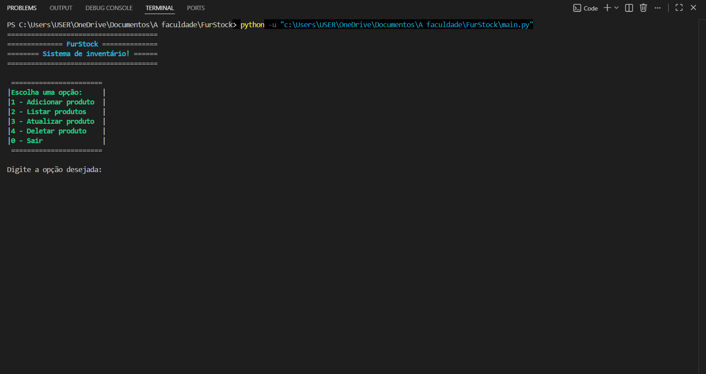
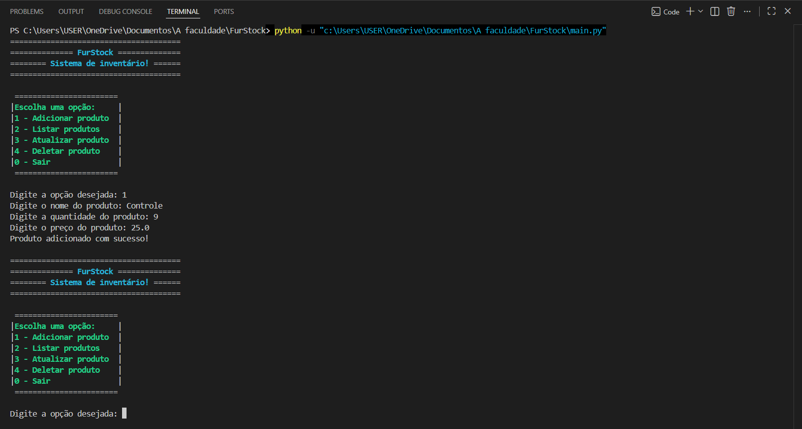
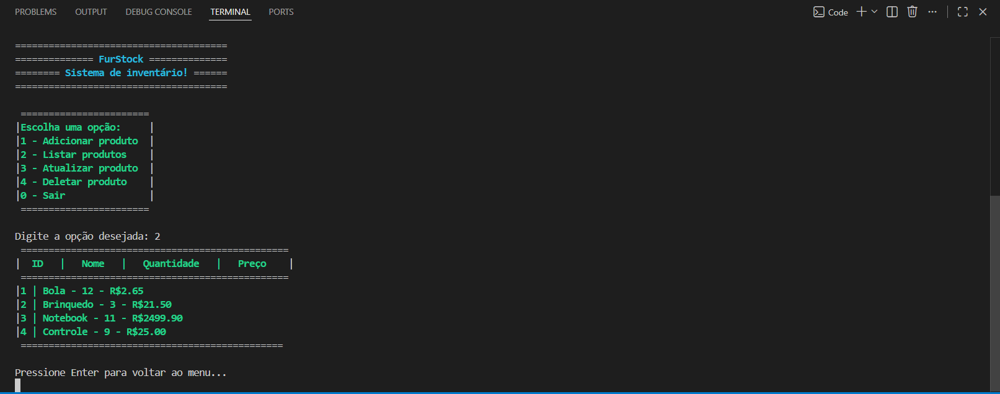
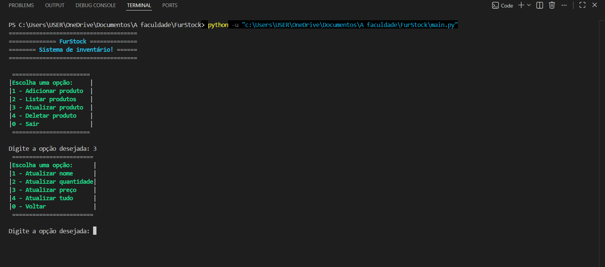
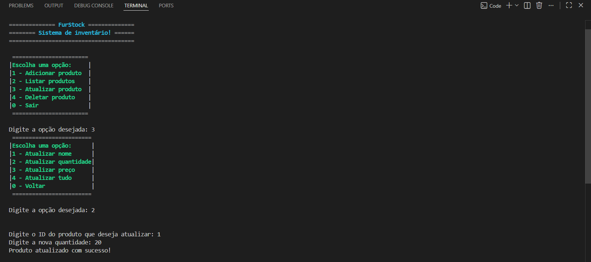
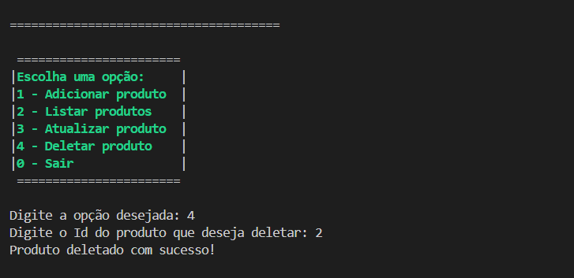
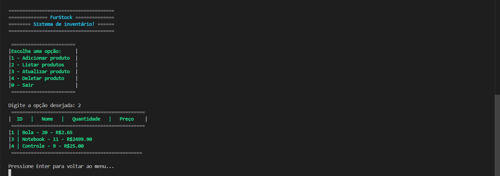
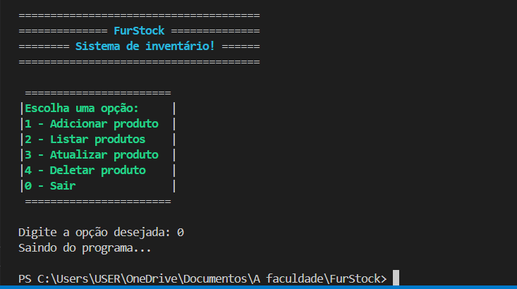

# 📦 FurStock - Sistema de Inventário

Um sistema de gerenciamento de estoque desenvolvido em Python, utilizando banco de dados relacional para controle de produtos em tempo real.

## 📝 Sobre o Projeto
O **FurStock** é uma ferramenta de terminal para controle de inventário que permite o cadastro, consulta, atualização e exclusão de itens. O projeto foi construído seguindo princípios de Programação Orientada a Objetos (POO), com uma arquitetura modular onde a interface de usuário (`main.py`) e a camada de persistência (`database.py`) são separadas.

O grande diferencial deste projeto é o uso do **SQLite3**, garantindo que os dados não sejam perdidos ao fechar o programa, simulando um cenário real de software empresarial.

## ✨ Funcionalidades
- ✅ **CRUD Completo:** Adicionar, Listar, Atualizar e Deletar produtos.
- ✅ **Persistência de Dados:** Uso de banco de dados SQLite (`inventario.db`) para armazenamento seguro.
- ✅ **Atualização Flexível:** Opção de atualizar campos específicos (nome, quantidade ou preço) ou o registro completo.
- ✅ **Validação de Existência:** Verificação inteligente de IDs antes de realizar operações de edição ou exclusão.
- ✅ **Interface Intuitiva:** Menu colorido via terminal para facilitar a navegação do usuário.

## 🛠️ Tecnologias Utilizadas
- **Linguagem:** Python 3
- **Banco de Dados:** SQLite3 (Embutido no Python)
- **Bibliotecas:** `sqlite3`, `time`

## 📸 Demonstração
<div align="center">
  
  
  
  
  
  
  
  
</div>

## 🚀 Como Executar

### Pré-requisitos
* Python 3.x instalado.

### Passo a passo
1. Clone o repositório:
   ```bash
   git clone [https://github.com/CFSC3/FurStock.git](https://github.com/CFSC3/FurStock.git)
   
2. Acesse a pasta do projeto:
   ```bash
   cd FurStock

3. Execute a aplicação:
   ```bash
   python main.py
